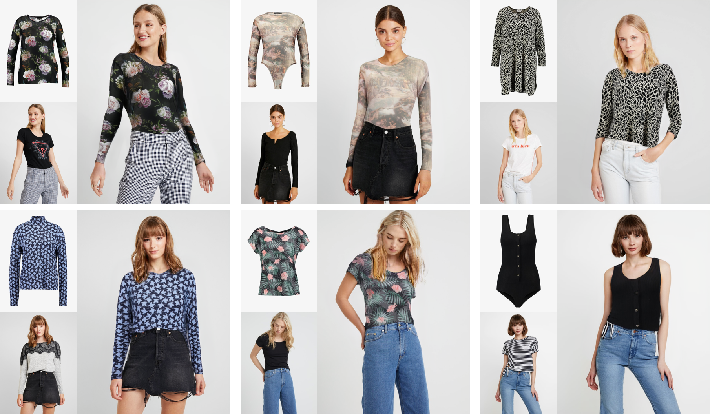
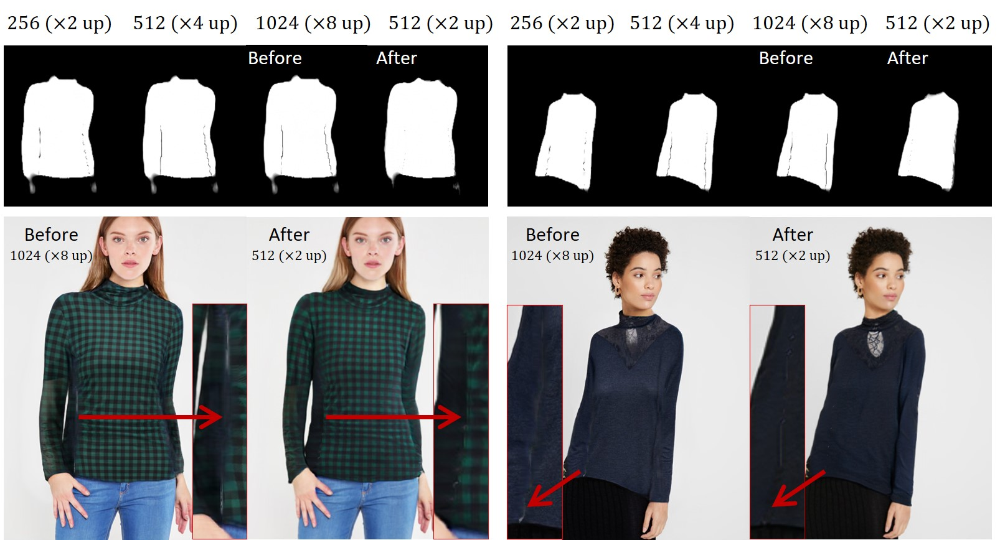

# SD-VITON-Virtual-Try-On
This is the official repository for the following paper:
> **Towards Squeezing-Averse Virtual Try-On via Sequential Deformation** [[arxiv]](https://arxiv.org/pdf/2312.15861.pdf)
>
> Sang-Heon Shim, Jiwoo Chung, Jae-Pil Heo  
> Accepted by **AAAI 2024**.

&nbsp;

## Notice
This repository is currently built only for sharing the source code of an academic research paper.  
It has several limitations. Please check out them at below.

## News
- *2024-01-31* We have released the source codes and checkpoints.


## Installation

Clone this repository:

```
git clone https://github.com/SHShim0513/SD-VITON.git
cd ./SD-VITON/
```

Install PyTorch and other dependencies:

```
conda create -n {env_name} python=3.8
conda activate {env_name}
conda install pytorch torchvision torchaudio cudatoolkit=11.1 -c pytorch-lts -c nvidia
pip install opencv-python torchgeometry Pillow tqdm tensorboardX scikit-image scipy timm==0.4.12
```

## Dataset
We train and evaluate our model using the dataset from the following [link](https://github.com/shadow2496/VITON-HD).  
We assume that you have downloaded it into `./data`.

## Inference

Here are the download links for each model checkpoint:

|Dataset|Network Type|Output Resolution|Google Cloud|
|--------|--------|--------|-----------|
| VITON-HD | Try-on condition generator | Appearance flows with 128 x 96 | [Download](https://drive.google.com/drive/folders/1sqKNvyTsF8HGAv72wV2nLIeZmYA1Za9V?usp=drive_link) |
| VITON-HD | Try-on image generator | Images with 1024 x 768 | [Download](https://drive.google.com/drive/folders/1nsbtVsjC2Y0XEZA9SYYrmI4K3TPr5--p?usp=drive_link) |  

- AlexNet (LPIPS): [link](https://drive.google.com/file/d/1CJ2HLzlYjp0PXgbeAH90CdJhZbHRVEKN/view?usp=drive_link), we assume that you have downloaded it into `./eval_models/weights/v0.1`.

```python
python3 test_generator.py --occlusion --test_name {test_name} --tocg_checkpoint {condition generator ckpt} --gpu_ids {gpu_ids} --gen_checkpoint {image generator ckpt} --datasetting unpaired --dataroot {dataset_path} --data_list {pair_list_textfile} --composition_mask
```
## Training

### Try-on condition generator

```python
python3 train_condition.py --gpu_ids {gpu_ids} --Ddownx2 --Ddropout --interflowloss --occlusion --tvlambda_tvob 2.0 --tvlambda_taco 2.0
```

### Try-on image generator

```python
python3 train_generator.py --name test -b 4 -j 8 --gpu_ids {gpu_ids} --fp16 --tocg_checkpoint {condition generator ckpt path} --occlusion --composition_mask
```
This stage takes approximately 4 days with two A6000 GPUs.

To use "--fp16" option, you should install apex library.

## Limitations
Our work still has several limitations that are not an unique problem of ours in our best knowledge.

### Issue #1: crack  

Several samples have sufferred from a crack artifact.  
In our best knowledge, the crack is amplified due to the up-sizing of last appearance flows (AFs).  
*E.g.*, our network infers the last AFs with 128 x 96 resolution, and then up-scales to 1024 x 768.  
Thereby, the crack regions are extended.

&nbsp;

A slightly reduceable way will be to infer the last AFs with more closer to an image resolution (see "After").  
We provide a checkpoint, where networks infer the AFs with 256 x 192 and an image with 512 x 384 resolution.  

|Dataset|Network Type|Output Resolution|Google Cloud|
|--------|--------|--------|-----------|
| VITON-HD | Try-on condition generator | Appearance flows with 256 x 192 | [Download](https://drive.google.com/drive/folders/1IUJeJQgdwJgoLRZ3v3zlGqKZpVNa-FHM?usp=share_link) |
| VITON-HD | Try-on image generator | Images with 512 x 384 | [Download](https://drive.google.com/drive/folders/1X4-oAans5bg72aei9rCM0P2tCbFxuB26?usp=share_link) |

The corresponding script for inference is as follows:
```python
python3 test_generator.py --occlusion --test_name {test_name} --tocg_checkpoint {condition generator ckpt} --gpu_ids {gpu_ids} --gen_checkpoint {image generator ckpt} --datasetting unpaired --dataroot {dataset_path} --data_list {pair_list_textfile} --fine_width 384 --fine_height 512 --num_upsampling_layers more --cond_G_ngf 48 --cond_G_input_width 384 --cond_G_input_height 512 --cond_G_num_layers 6
```

### Issue #2: clothes behind the neck
Same as other methods, our network cannot fully remove the clothes textures behind the neck.  
Thereby, it remains in the generated samples.  

A solution would be to mask out such regions when pre-processing the inputs.  
We did not apply such additional technique, since it was not included in a dataset.

## Acknowledgments

This repository is built based on HR-VITON repository. Thanks for the great work.

## Citation

If you find this work useful for your research, please cite our paper:

```
@article{shim2023towards,
  title={Towards Squeezing-Averse Virtual Try-On via Sequential Deformation},
  author={Shim, Sang-Heon and Chung, Jiwoo and Heo, Jae-Pil},
  journal={arXiv preprint arXiv:2312.15861},
  year={2023}
}
```
